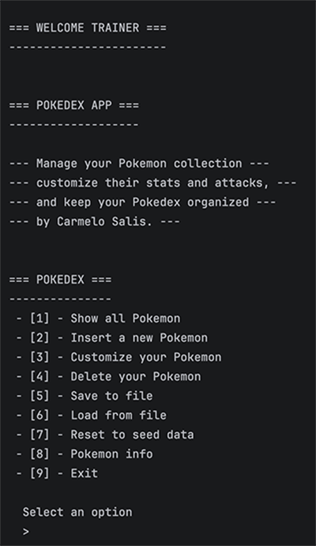
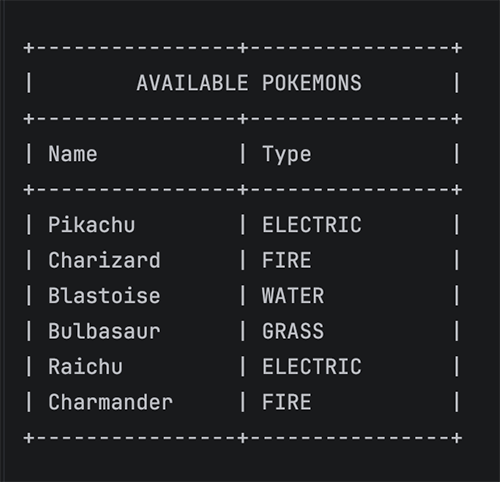
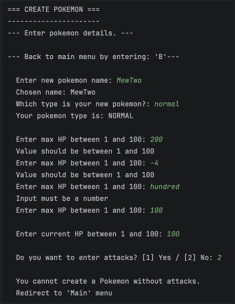
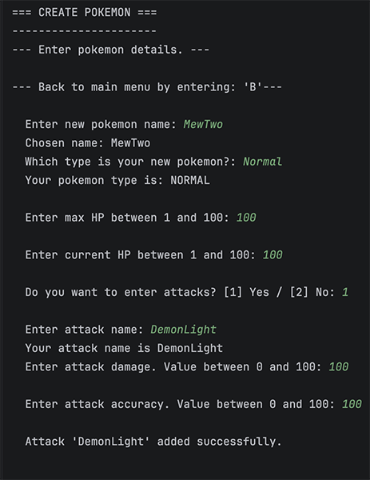
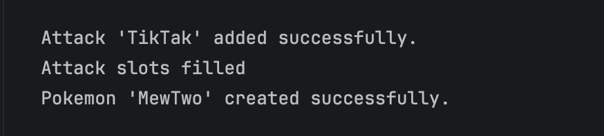
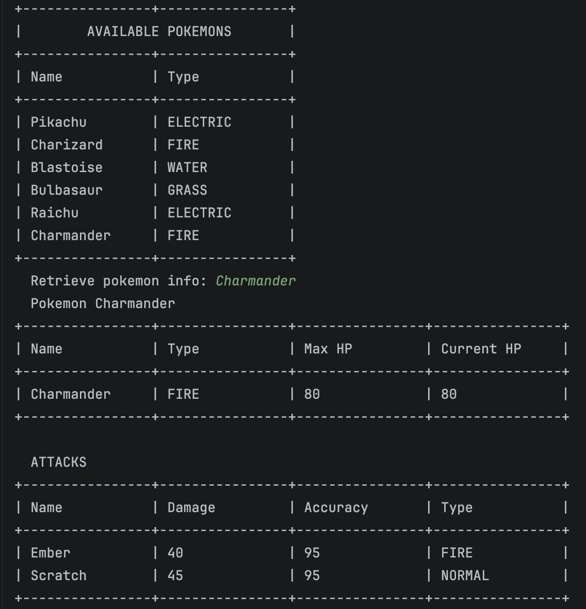

# Pokédex

A Java console application for managing a collection of Pokémon.

The application allows the user to view, create, edit and delete Pokémon, as well as save and load data from a file. The application also includes input validation to prevent crashes caused by invalid user input.

## How to Run

### IntelliJ IDEA

1. Clone the repository.
2. Open the project in IntelliJ IDEA.
3. Make sure Java 21 is configured.
4. Run `Main.java`.

### Maven
From the project root, run:

```bash
mvn clean compile
```

Then run the `Main` class.

## Example Usage
When the application starts, the user is shown the main menu:


The application load the pokemons from a JSON file. Option 1 from menu displays the Pokémon stored in the Pokédex:


Invalid input is handled without crashing the application:

The application allow to Create, Edit and Delete Pokemons



Every pokemon can have max 4 attacks. Reaching 4 attacks will show a message:


Option 8 show all pokemons with respective attacks
